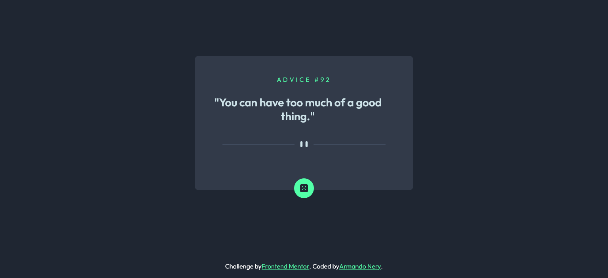

# Frontend Mentor - Advice generator app solution

This is a solution to the [Advice generator app challenge on Frontend Mentor](https://www.frontendmentor.io/challenges/advice-generator-app-QdUG-13db). Frontend Mentor challenges help you improve your coding skills by building realistic projects.

## Table of contents

- [Overview](#overview)
  - [The challenge](#the-challenge)
  - [Screenshot](#screenshot)
  - [Links](#links)
- [My process](#my-process)
  - [Built with](#built-with)
  - [What I learned](#what-i-learned)
  - [Continued development](#continued-development)
  - [Useful resources](#useful-resources)
- [Author](#author)

## Overview
This challenge uses the Advice Slip API to generate random quotes of advice.

### The challenge

Users should be able to:

- View the optimal layout for the app depending on their device's screen size
- See hover states for all interactive elements on the page
- Generate a new piece of advice by clicking the dice icon

### Screenshot



### Links

- Solution URL: [https://www.frontendmentor.io/solutions/advice-generator-SjDFlSG6R]
- Live Site URL: [https://advice-generator-seven.vercel.app/]

## My process

### Built with

- Semantic HTML5 markup
- CSS custom properties
- Flexbox

### What I learned

I put in practice calling an API with fetch method 

```js
fetch('https://api.adviceslip.com/advice')
    .then(response => {
        return response.json();
    })
    .then(advices => {
        
        let id = advices.slip.id;
        let advice = advices.slip.advice;

        document.getElementById('id').innerHTML = `ADVICE #${id}`
        document.getElementById('text').innerHTML = `"${advice}"`;
    })
```

Also a way to set a class with setAttribute 
```js
function diceAdvice() {
    const icon = document.getElementById('icon');
    icon.setAttribute("class", "rotated-image");
    location.reload();
}
```

That allowed me to add the animation to the dice image
```css
.rotated-image {
    animation: rotation 1s infinite linear;
  }

@keyframes rotation {
    from {
        transform: rotate(0deg);
    }
    to {
        transform: rotate(359deg);
    }
}
```

### Continued development

Some areas I'd like to master or even to remeber more easily are:
- Fetch syntax
- .setAttribute
- Media queries

### Useful resources

- [Example resource 1](https://stackoverflow.com/questions/19799846/javascript-rotate-img-on-click) - This helped me for adding the rotation animation to the dice image.
- [Example resource 2](https://levelup.gitconnected.com/all-possible-ways-of-making-an-api-call-in-plain-javascript-c0dee3c11b8b) - This is an amazing article which helped me finally understand many possible ways to call an API in vanilla. I'd recommend it to anyone still learning this concept.

## Author

- Website - [Armando Nery](https://armandonery.vercel.app/)
- Frontend Mentor - [@armandonery](https://www.frontendmentor.io/profile/armandonery)